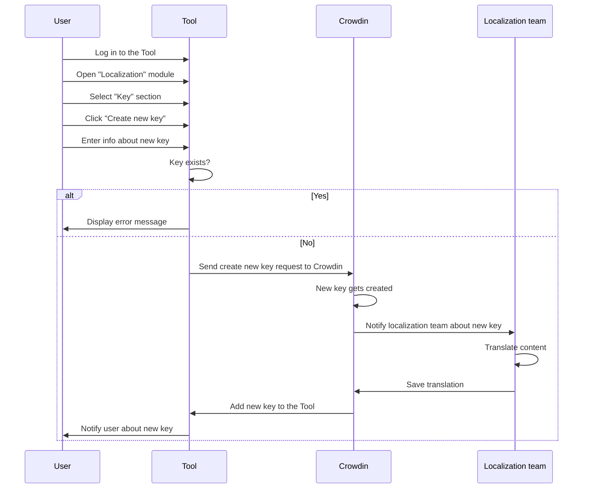

The Tool's *Localization* module lets you manage localizations with the assistance of the third-party service Crowdin. 

## Localization workflow

Localization requests in the Localization module go through the following process:

1. A user logs in to the Tool, creates a new key, and provides the required information.
2. The Tool sends a request to Crowdin to create the new key.
3. Crowdin processes the request. if the key exists, it displays an error message and creates a new key otherwise.
4. The localization team is notified about the new key.
5. The localization team performs the translation for the new key.
6. The new key and its translations are sent back to the Tool.
7. The user is notified about the successful translation of the new key.

The following sequence diagram shows the localization process:

## Related user guides

[Request localization](/docs/test-tasks/welltech/request-localization.md)