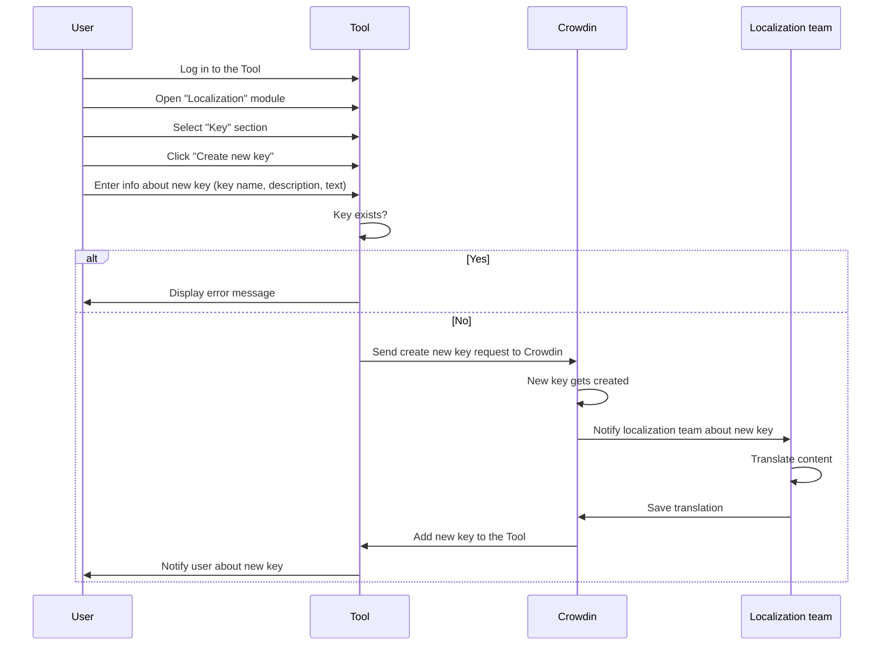

The Tool's *Localization* module lets you manage localizations with the assistance of the third-party service Crowdin.

## Localization flow

When you create a request for text translation, the requests go through the following steps:

1. A user logs in to the Tool, creates a new key, and provides the required information.
2. The Tool checks if the key exists. If it does, an error message is displayed. Otherwise, the Tool sends a request to Crowdin to create the new key.
3. Crowdin processes the request and the localization team is notified about the new key.
4. The localization team performs the translation for the new key.
5. The new key and its translations are sent back to the Tool.
6. The user is notified about the successful translation of the new key.

The following diagram illustrates the localization process:

## Related user guides

[Request localization](/docs/test-tasks/welltech/request-localization.md)